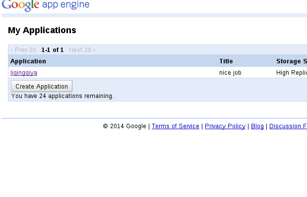
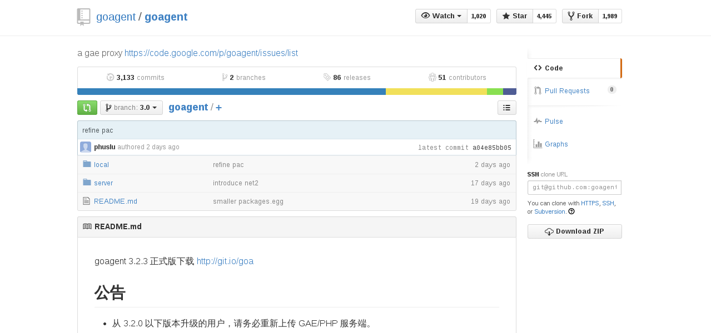
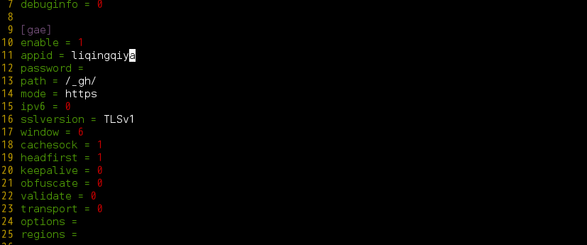
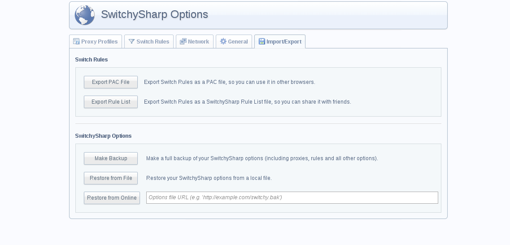
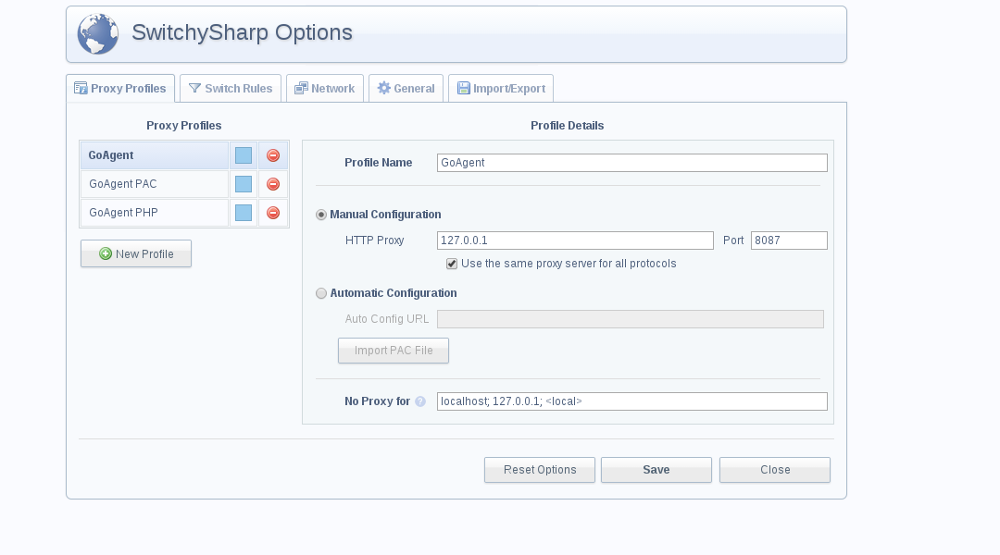
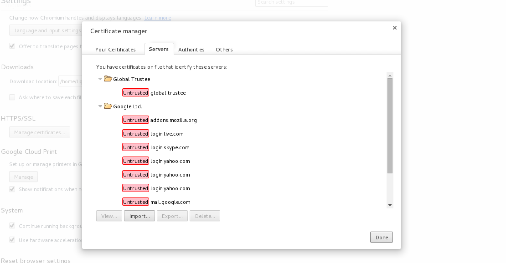

环境: linux(debian)/chrome/goagent
=========================================

1. 你首先的有一个google帐号.注册google帐号之后, 你得创建一个gae应用.这个时候假设你已经完成了以上两步.完成之后, 你进入到你的app
界面应该是这样的:

2. 下载goagent程序代码:下载地址可以去github上: https://github.com/goagent/goagent, 如果你有git, 
那么可以直接克隆下来,ssh地址为: git@github.com:goagent/goagent.git.

那么现在你完成的工作是: 创建了一个gae应用, 并且下载了goagent源码.

3. 上传这个程序文件到你的gae的app上. 上传很简单, 只要你运行server目录下的uploader.py就行.
在上传的过程中, 你可能会出现问题. 导致你上传不成功. 这个时候你要先把你google账户设置中的安全设置
设置为:允许不安全软件的运行.appid就是你的gae的application的名字. 邮箱密码就是你谷歌账户的
帐号密码.

4. 上传成功之后, 要修改goagent/local/proxy.ini, 将appid改成你自己的appid.
这样goagent就配置完成了

5. 安装一个插件SwitchySharp Options, 这个插件已经包含在goagent的程序目录里了. 你可以把SwitchyOptions.crx
拖到chrome插件安装就行了, 当然你也可以搜索安装这个插件.
安装之后: 

6. 导入SwitchyOptions.bat文件.点击Restore from file, 把这个文件导入.

导入之后:

6. 导入证书CA.crt, 这里不要弄错了位置, Manage certificates, server,也就是服务器的那一项导入.

7. 启动程序proxy.py就行了.运行的时候可能会出现警告:你的先安装一些python库, 比如ssl库,crypto库.
安装:`sudo aptitude install python-openssl`和`sudo aptitude install python-crypto`
